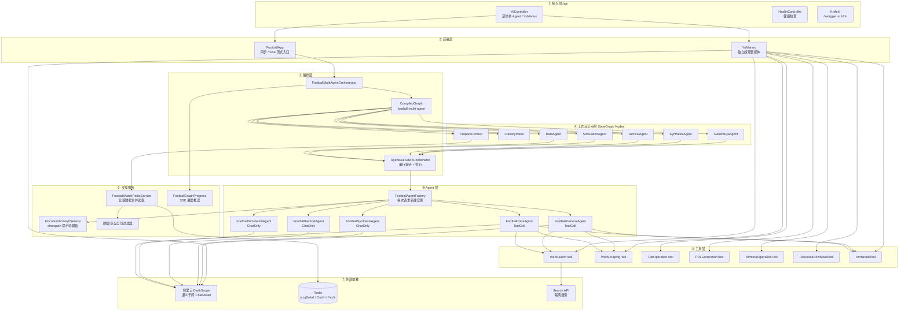
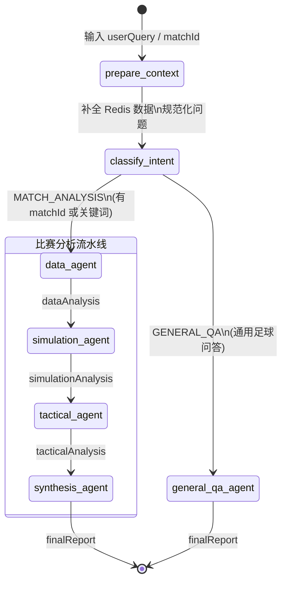
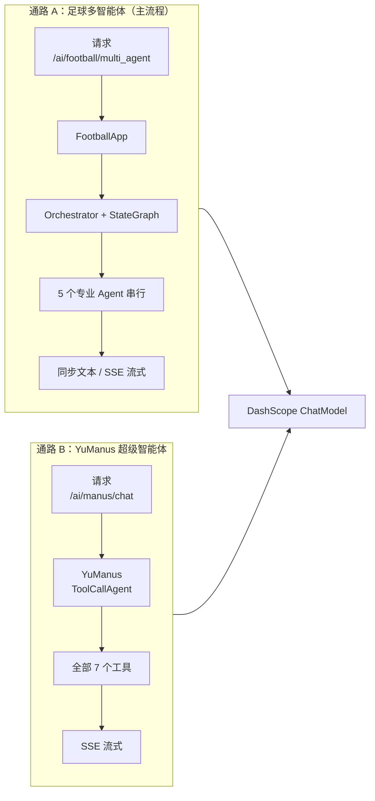
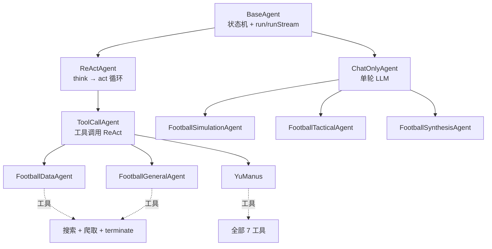
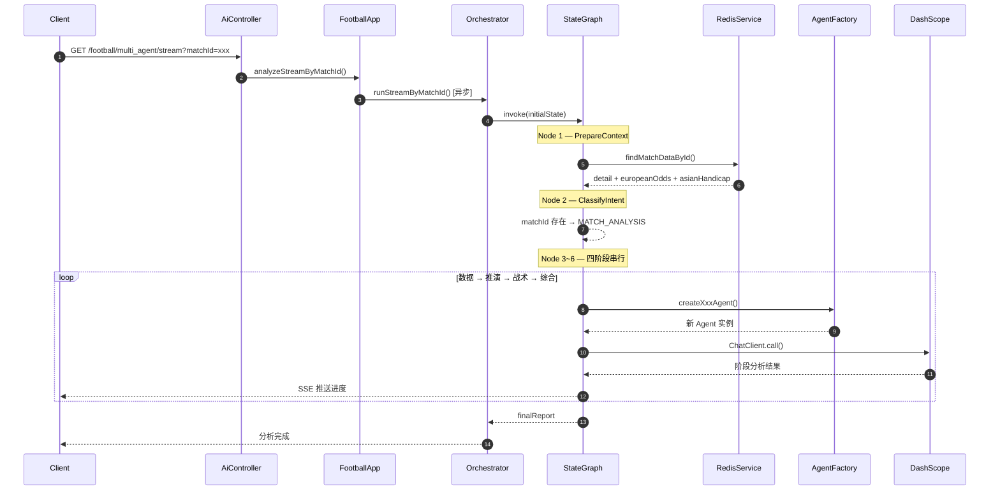

# Super-Soccer

基于 **Spring Boot 3** + **Spring AI Alibaba** + **阿里云 DashScope（通义千问）** 的足球多智能体分析系统。通过 StateGraph 工作流编排多个专业 Agent，支持比赛数据分析、赛果推演、战术解读与综合报告生成。

---

## 功能特性

- **足球多智能体流水线**：数据 → 推演 → 战术 → 综合，四阶段串行协作
- **意图路由**：自动识别「比赛分析」与「通用足球问答」，走不同执行路径
- **Redis 比赛数据接入**：按 `matchId` 自动读取详情、欧盘、亚盘并合并
- **SSE 流式输出**：实时推送各 Agent 阶段进度与结果
- **独立模型配置**：每个 Agent 可使用不同的通义千问模型
- **工具调用能力**：数据 Agent / 通用 Agent 支持联网搜索与网页爬取
- **YuManus 超级智能体**：独立通路，集成全部 7 个工具
- **提示词模板化**：从 `classpath:/document/**/*.md` 加载，支持占位符渲染

---

## 技术栈

| 类别 | 技术 |
|------|------|
| 运行时 | Java 21 |
| 框架 | Spring Boot 3.3 |
| AI 框架 | Spring AI Alibaba 1.1.2 |
| 大模型 | 阿里云 DashScope（通义千问） |
| 工作流 | Alibaba Agent Framework `StateGraph` |
| 缓存 | Spring Data Redis |
| API 文档 | Knife4j + springdoc-openapi |
| 工具 | 搜索 API、Jsoup、iText PDF、终端命令等 |

---

## 系统架构

### 分层全景



### StateGraph 工作流



**意图路由规则**（`FootballIntentClassifier`）：

| 条件 | 路由 |
|------|------|
| 请求携带 `matchId` | 比赛分析流水线 |
| 问题含「预测、赔率、分析这场」等关键词 | 比赛分析流水线 |
| 其他 | 通用足球问答 Agent |

**Graph State 共享字段：**

| Key | 说明 |
|-----|------|
| `userQuery` | 用户问题 |
| `matchId` | 比赛 ID（可选） |
| `redisRawData` | Redis 合并 JSON |
| `intent` | `MATCH_ANALYSIS` / `GENERAL_QA` |
| `dataAnalysis` | 数据 Agent 输出 |
| `simulationAnalysis` | 推演 Agent 输出 |
| `tacticalAnalysis` | 战术 Agent 输出 |
| `finalReport` | 最终报告 |

### 双通路架构



### Agent 体系



| Agent | 类型 | 默认模型 | 工具 |
|-------|------|----------|------|
| 数据 Agent | ToolCall | qwen-plus-0112 | 搜索、爬取、terminate |
| 推演 Agent | ChatOnly | qwen-max | 无 |
| 战术 Agent | ChatOnly | qwen3-max | 无 |
| 综合 Agent | ChatOnly | qwen-plus-1220 | 无 |
| 通用 Agent | ToolCall | qwen-max | 搜索、爬取、terminate |
| YuManus | ToolCall | qwen-max | 全部 7 个工具 |

---

## 项目结构

```
src/main/java/com/example/javaai/
├── controller/              # REST 接口
│   ├── AiController.java
│   └── HealthConroller.java
├── app/
│   └── FootballApp.java     # 足球多 Agent 应用入口
├── agent/
│   ├── BaseAgent.java       # Agent 基类
│   ├── ReActAgent.java      # 思考-行动循环
│   ├── ToolCallAgent.java   # 工具调用 Agent
│   ├── ChatOnlyAgent.java   # 纯对话 Agent
│   ├── YuManus.java         # 超级智能体
│   ├── AgentExecutionCoordinator.java
│   └── football/
│       ├── FootballDataAgent.java
│       ├── FootballSimulationAgent.java
│       ├── FootballTacticalAgent.java
│       ├── FootballSynthesisAgent.java
│       ├── FootballGeneralAgent.java
│       ├── FootballAgentFactory.java
│       ├── FootballMultiAgentOrchestrator.java
│       ├── FootballMatchRedisService.java
│       └── graph/           # StateGraph 节点与状态管理
│           └── node/
├── config/
│   ├── FootballStateGraphConfig.java
│   ├── FootballAgentsChatModelConfig.java
│   ├── DashScopeHttpClientConfig.java
│   └── FootballRedisConfig.java
├── tool/                    # 7 个工具实现
├── prompt/
│   └── DocumentPromptService.java
└── resources/
    ├── application.yml
    └── document/football/   # 各 Agent 提示词模板
        ├── 数据Agent提示词.md
        ├── 推演Agent提示词.md
        ├── 战术Agent提示词.md
        ├── 综合Agent提示词.md
        └── 通用Agent提示词.md
```

---

## 快速开始

### 环境要求

- JDK 21+
- Maven 3.8+
- Redis（可选，用于 `matchId` 比赛数据读取）
- 阿里云 DashScope API Key
- Search API Key（可选，用于联网搜索）

### 1. 克隆项目

```bash
git clone https://github.com/<your-username>/Java-Ai.git
cd Java-Ai
```

### 2. 配置本地环境

项目默认激活 `local` Profile。请在 `src/main/resources/` 下创建 **`application-local.yml`**（该文件已在 `.gitignore` 中，不会提交到 Git）：

```yaml
spring:
  data:
    redis:
      host: localhost
      port: 6379
      database: 0
  ai:
    dashscope:
      api-key: <你的 DashScope API Key>
      chat:
        options:
          model: qwen-max
          enable-thinking: true

search-api:
  api-key: <你的 Search API Key>
```

> DashScope API Key 获取地址：[阿里云百炼控制台](https://dashscope.console.aliyun.com/)

### 3. 启动服务

```bash
# Windows
mvnw.cmd spring-boot:run

# Linux / macOS
./mvnw spring-boot:run
```

服务启动后访问：`http://localhost:8123/api`

### 4. 健康检查

```bash
curl http://localhost:8123/api/health
# 返回: OK
```

---

## API 接口

| 方法 | 路径 | 说明 |
|------|------|------|
| GET / POST | `/api/ai/football/multi_agent/stream` | 足球多 Agent SSE 流式输出 |
| GET | `/api/ai/football/multi_agent` | 足球多 Agent 同步返回最终报告 |
| GET | `/api/ai/manus/chat` | YuManus 超级智能体 SSE 流式 |
| GET | `/api/health` | 健康检查 |
| — | `/api/swagger-ui.html` | Knife4j API 文档 |

### 请求参数

| 参数 | 类型 | 必填 | 说明 |
|------|------|------|------|
| `message` | String | 否 | 用户问题；传 `matchId` 时可留空 |
| `matchId` | String | 否 | 比赛 ID，有值时从 Redis 读取数据 |

### 调用示例

**流式分析（带比赛 ID）：**

```bash
curl -N "http://localhost:8123/api/ai/football/multi_agent/stream?matchId=1366392&message=分析这场比赛"
```

**同步获取最终报告：**

```bash
curl "http://localhost:8123/api/ai/football/multi_agent?message=今晚英超有什么看点"
```

**YuManus 超级智能体：**

```bash
curl -N "http://localhost:8123/api/ai/manus/chat?message=帮我搜索今日足球赛程"
```

---

## 配置说明

### 各 Agent 模型配置

在 `application.yml` 中按 Agent 独立配置模型，无需修改 Java 代码：

```yaml
app:
  ai:
    football:
      agents:
        data:
          model: qwen-plus-0112
          enable-thinking: true
        simulation:
          model: qwen-max
          enable-thinking: true
        tactical:
          model: qwen3-max
          enable-thinking: true
        synthesis:
          model: qwen-plus-1220
          enable-thinking: true
        general:
          model: qwen-max
          enable-thinking: true
```

### Redis 比赛数据 Key

```yaml
app:
  football:
    redis:
      key-suffix: ":false"
      keys:
        detail: "jczqDetail::"    # 比赛详情
        ouzhi: "jczqOuzhi::"      # 百家欧盘
        yazhi: "jczqYazhi::"      # 百家亚盘
```

完整 Key 示例：`jczqDetail::1366392:false`

---

## 数据流（matchId 请求）



---

## 开发说明

### 添加新 Agent

1. 在 `agent/football/` 下创建 Agent 类（继承 `ChatOnlyAgent` 或 `ToolCallAgent`）
2. 在 `resources/document/football/` 添加对应提示词 `.md` 文件
3. 在 `FootballAgentFactory` 注册创建方法
4. 在 `graph/node/` 添加 Graph 节点
5. 在 `FootballStateGraphConfig` 注册节点与边

### 修改提示词

直接编辑 `src/main/resources/document/football/` 下的 `.md` 文件，支持 `{{变量名}}` 占位符，由 `DocumentPromptService` 在运行时渲染。

### 运行测试

```bash
mvnw test
```

---

## License

MIT
